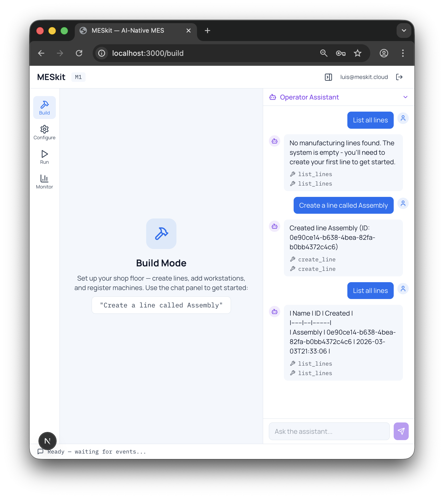

# MESkit

**Finally, an MES that's as easy to use as asking a question.**

Open-source MES toolkit with built-in analytics, quality alerts, and natural language queries. ISA-95 aligned, simulation-first, MQTT-ready.

**[meskit.cloud](https://meskit.cloud)**



---

## Documentation Foundation

MESkit's core docs are intentionally connected so product, roadmap, growth, and onboarding decisions stay aligned:

- [Documentation Map](docs/DOCUMENTATION_MAP.md) — how the core docs fit together
- [Product Principles](PRODUCT_PRINCIPLES.md) — what MESkit must remain
- [PRD](MESKIT_PRD.md) — product strategy, scope, and architecture
- [Roadmap](ROADMAP.md) — milestone execution plan
- [Licensing and Growth Strategy](LICENSING_AND_GROWTH_STRATEGY.md) — PLG, packaging, and licensing direction
- [Target Audience](docs/GTM_Target_Audience.md) — ICP and acquisition focus
- [Manufacturing Software Stack](docs/MANUFACTURING_SOFTWARE_STACK.md) — onboarding integration priorities

## What is MESkit?

MESkit is a complete, buildable Manufacturing Execution System built on the ISA-95 standard. It starts with simulation, includes smart features powered by an intelligence layer, and is architecturally ready for real sensor input via MQTT.

Every MES operation — moving a lot, logging a defect, querying yield — flows through a **tool layer** that both the UI and smart features consume. The same function that powers a button click also powers a natural-language command. Smart features are force multipliers for human operators — they remove the coordination bottleneck so one supervisor can manage twice the throughput.

All data persists in Supabase (Postgres). Updates push to all clients via Realtime subscriptions.

### North Star

> See problems before they stop your line. MESkit monitors machine health, surfaces quality trends, and helps you plan production — so your team acts on insights instead of chasing data.

## Who is it for?

- **Manufacturing engineers** learning MES concepts without enterprise software
- **Small shops** that need a real MES without the price tag
- **Developers** building manufacturing apps who want a reference stack
- **Teams exploring smart manufacturing** who want real MES tools with built-in analytics, not chatbot demos

## Current Status: M3 Complete

M1 (scaffold), M2 (Build Mode + Ask MESkit), and M3 (Configure Mode) are complete.

- **Auth** — Signup, login, logout, protected routes with Supabase Auth
- **ISA-95 Schema** — 15 Postgres tables with RLS, enums, indexes, and Realtime publications
- **Tool Layer** — 26 registered tools (8 shop floor fully implemented, 18 stubs for M3-M5)
- **Intelligence Layer** — Gemini tool-use loop with streaming, Ask MESkit active
- **UI Shell** — Sidebar (Build/Configure/Run/Monitor), top bar, collapsible chat panel, live ticker
- **End-to-end verified** — "Create a line called Assembly" in chat calls `create_line`, persists to Supabase, confirmed via `list_lines`

## Core Loop

```
Define product → Build route → Move units → Collect data → Visualize
```

Four modes drive the UI, with a chat panel always available:

| Mode | What you do |
|------|-------------|
| **Build** | Create lines, workstations, machines |
| **Configure** | Define part numbers, BOMs, routes, serial algorithms |
| **Run** | Generate units, move them through production, inject quality events |
| **Monitor** | Live WIP counts, throughput charts, yield summaries, unit lookup |

## Smart Features

MESkit's smart features are designed around three complementary automation layers that, together, deliver the North Star:

| Layer | Role | Feature | Available |
|-------|------|---------|-----------|
| **Act** | Acts on decisions through the tool layer — updates schedules, notifies operators | Intelligence Layer | M1 |
| **Plan** | Evaluates constraints (backlog, deadlines, capacity), computes alternative schedules | Production Planner | M5 |
| **Monitor** | Monitors sensor telemetry, detects degradation, outputs failure probability scores | Machine Health Monitor | M6 |

Three smart features ship with MESkit:

| Feature | Trigger | Role |
|---------|---------|------|
| **Ask MESkit** | Chat (always available) | Natural language interface — query WIP, move units, log defects in plain English |
| **Quality Monitor** | Event-driven | Monitors yield, detects defect clusters, surfaces proactive alerts |
| **Production Planner** | Chat (on demand) | Capacity analysis, scheduling, route optimization |

Smart features call the same tool layer as the UI. No special APIs, no separate data paths.

## Architecture

```
Frontend (Next.js)  →  Tool Layer (Server Actions)  →  Supabase (Postgres)
Smart Features      →  Tool Layer (Server Actions)  →  Supabase (Postgres)
```

| Layer | Tech |
|-------|------|
| Frontend | Next.js (App Router), Tailwind CSS, Zustand, Recharts |
| Tool Layer | Next.js Server Actions, Zod validation |
| Intelligence Layer | Gemini API (tool-use), `@google/generative-ai` |
| Backend | Supabase (Postgres, Auth, Realtime, Edge Functions) |
| Device (future) | MQTT broker (Mosquitto / HiveMQ Cloud) |

## Data Model

ISA-95 aligned Postgres tables:

```
Physical    lines → workstations → machines
Product     part_numbers → items → bom_entries
Process     routes → route_steps
Production  units → unit_history
Quality     quality_events, defect_codes
Config      serial_algorithms
Agent       agent_conversations
Ingestion   mqtt_messages (future)
```

## MQTT-Ready

The interface contract is defined now, implemented in M6:

- **Topics**: `meskit/{line_id}/{workstation_id}/{event_type}`
- **Messages**: `{ timestamp, machine_id, event_type, payload }`
- **Bridge**: Supabase Edge Function subscribes to the broker, validates, writes to Postgres
- **Simulation mode**: A virtual device publishes fake messages using the same schema

## Roadmap

| Milestone | Scope | Status |
|-----------|-------|--------|
| **M1** | Project scaffold, Supabase schema, auth, tool layer, intelligence layer, UI shell | Done |
| **M2** | Build Mode + Ask MESkit — CRUD via UI and chat | Done |
| **M3** | Configure Mode — Part numbers, BOM, routes via UI and chat | Done |
| M4 | Run Mode + Quality Monitor — Production execution with proactive quality alerts | |
| M5 | Monitor Mode + Planner — Dashboard with analytics and production planning | |
| M6 | MQTT interface + Machine Health Monitor — Broker, device gateway, predictive maintenance | |

## What MESkit Is NOT

MESkit is not a learning exercise or a demo wrapper around a vendor API. It is a standalone product with its own persistence layer, authentication, real-time infrastructure, and intelligence layer. No proprietary API dependencies — MESkit follows the ISA-95 standard data model.

## Getting Started

```bash
git clone https://github.com/meskit-cloud/meskit.git
cd meskit
npm install
```

Copy the environment template and fill in your credentials:

```bash
cp .env.local.example .env.local
```

You'll need:

- A [Supabase](https://supabase.com) project — run `supabase/migrations/001_isa95_schema.sql` in the SQL editor
- A [Gemini API key](https://ai.google.dev) — for the natural language interface

```bash
npm run dev
```

Open [localhost:3000](http://localhost:3000), sign up, and start using Ask MESkit.

## Docs

- [Documentation Map](docs/DOCUMENTATION_MAP.md) — Core documentation system and source-of-truth guide
- [Product Principles](PRODUCT_PRINCIPLES.md) — Durable product truths and decision rules
- [Full PRD](MESKIT_PRD.md) — Product strategy, architecture, pricing, and milestones
- [Roadmap](ROADMAP.md) — Detailed milestone checklists and future tracks
- [Licensing and Growth Strategy](LICENSING_AND_GROWTH_STRATEGY.md) — Product-led growth, packaging, and licensing direction
- [Target Audience](docs/GTM_Target_Audience.md) — ICP, search intent, and GTM focus
- [Manufacturing Software Stack](docs/MANUFACTURING_SOFTWARE_STACK.md) — Integration priorities that reduce onboarding friction
- [Licensing](LICENSING.md) — Plain-English usage rights

## License

Source-available under the Business Source License 1.1. Internal self-hosting
and internal production use are allowed. Hosted resale, white-labeling, and
commercial third-party offering require a separate written agreement.

See [LICENSE](LICENSE) and [LICENSING.md](LICENSING.md).
